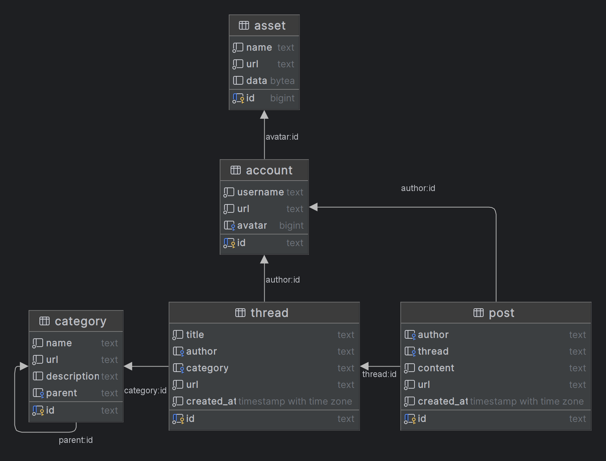

# lurker-themodders

lurker-themodders is a scrapper designed to scrape the forum https://themodders.org by fetching the content and saving
it in a PostgreSQL database as pure data instead of HTML pages.

## Usage

Download release package from the [releases page](https://github.com/piotrmacha/lurker-themodders/releases). Available:

* **lurker-themodders-java21.zip** - Application compiled for Java 21+ runtime as a standalone JAR file.
* **lurker-themodders-linux-amd64.zip** - Application compiled as native image for Linux x86_64. 
  May contain bugs - in case of problems, use the Java version. 

### Start Docker PostgreSQL

You can change the database credentials and port in `.env` file.

```shell
docker compose up -d
````

### Download full content

```shell
export $(cat .env | xargs)
java -Xmx1G -jar ./lurker-themodders.jar download \ 
  --save-visited true \ 
  --skip-visited false \ 
  --asset-database false \ 
  --asset-filesystem true \ 
  --asset-dir "./assets"
```

### Download only newest posts

```shell
export $(cat .env | xargs)
java -Xmx1G -jar ./lurker-themodders.jar \ 
  --save-visited true \ 
  --skip-visited false \ 
  --asset-database false \ 
  --asset-filesystem true \ 
  --asset-dir "./assets"
```

### Command-Line Arguments

- `--adapter [string]` - Adapter to use. Default: `themodders`
- `--url [string]` - URL of the forum to scrape. Default: `https://themodders.org`
- `--save-visited [boolean]` - Save visited URLs to the database. Default: `true`
- `--clear-visited [boolean]` - Clear visited URLs from the database. Default: `false`
- `--skip-visited [boolean]` - Skip visited URLs. Default: `false`
- `--asset-database [boolean]` - Save assets in the database. Default: `true`
- `--asset-filesystem [boolean]` - Save assets in the filesystem. Default: `false`
- `--asset-dir [string]` - Directory to save assets. Default: `./assets`
- `--threads [int]` - Number of threads to use. Default: `64`
- `--threads-virtual [boolean]` - Use virtual threads. Default: `false`

  **Warning**: Virtual threads don't work well and can deadlock the application. Use with caution.  
- `--http-connections [int]` - Maximum HTTP connections. Default: `32`

### Database Schema

The database model for dump is very simple. We save the categories (forum boards), threads, posts, and assets. Assets
contain both the accounts avatars and images referenced in the posts content.



Additionally, PostgreSQL `tsvector` indexes are used to provide full-text search capabilities on `post.content` and `thread.title`
fields with the `pl_ispell` tokenizer. Example full-text query:

```sql
select
    p.id,
    t.title as thread,
    a.username as author,
    p.content as content,
    ts_rank_cd(to_tsvector('pl_ispell', content), websearch_to_tsquery('pl_ispell', 'szukamy mouda')) as score
from post p
join thread t on t.id = p.thread
join account a on a.id = p.author
where
    to_tsvector('pl_ispell', p.content) @@ websearch_to_tsquery('pl_ispell', 'szukamy mouda')
order by score desc;
```

## Development

For development purposes, you can use the provided docker-compose file to start a PostgreSQL.

Copy the example environment file to a `.env` file.

```shell
cp example.env .env
```

Then, start the PostgreSQL database.

```shell
docker-compose up -d
```

Migrate the database and generate the JOOQ classes if you have changed the schema.

```shell
./gradlew flywayMigrate
./gradlew generateJooq
```

To run the project you can use the following command:

```shell
source .env
./gradlew bootRun --args='download --adapter="themodders" --url=https://themodders.org'
```

If you are using other tools (like IntelliJ IDEA), you have to include the environment variables from the .env file.

### Architecture

The application is a Spring Boot application that uses Spring Shell to provide a CLI interface and JOOQ to interact with
the database.

#### pl.piotrmacha.lurker.adapters

Adapters implementing `pl.piotrmacha.lurker.DownloadAdaper`. 
The adapter is responsible for fetching the content from the forum and using provided context to save them in the database.

#### pl.piotrmacha.lurker.domain

This package contains the domain model of the application. DownloadService coordinates the download process and provides
a `pl.piotrmacha.lurker.DownloadContext` to the adapter with methods to save the data in the database.

#### pl.piotrmacha.lurker.command

Spring Shell commands that are used to interact with the application.

#### pl.piotrmacha.lurker.jooq

Contains JOOQ generated classes. The classes are generated by the `generateJooq` task and should not be modified.

## License

The project is licensed under [MIT license](./LICENSE.md).